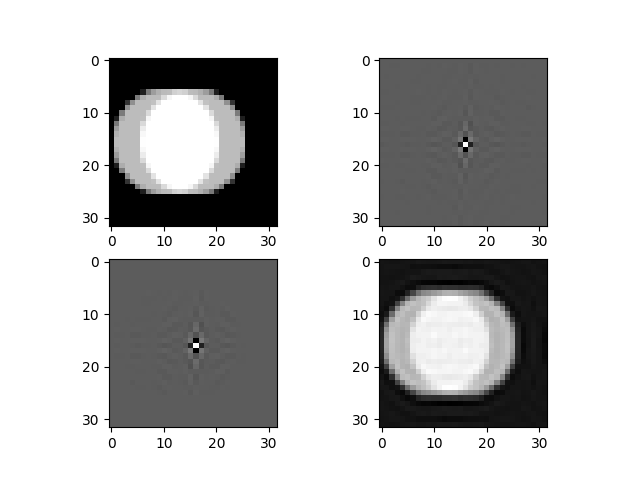
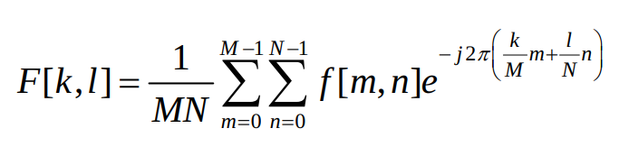
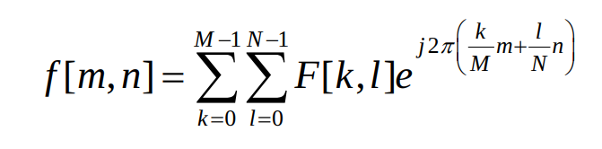
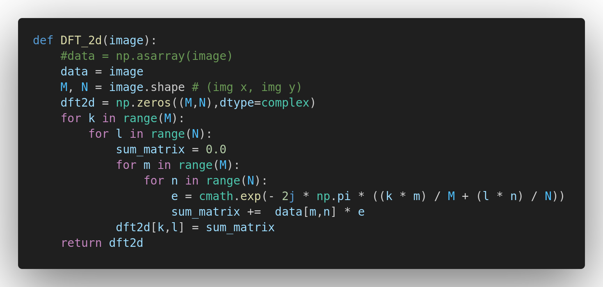
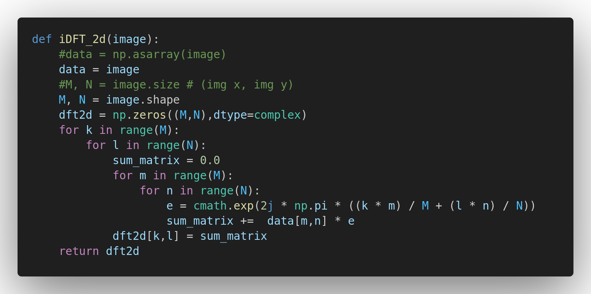

# Image Fourier Transform Example
A simple demo of Fourier image transformation by from-scratch DFT and iDFT functions.



## Rationale
The discrete two-dimensional Fourier transform of an image array is defined in series form as



inverse transform




These 4 steps are:
1. Showing the original spatial domain of the input image.
2. Transform it into the Frequency Domain by applying the Fourier Transform, then show the F-image.
3. Cutting some frequencies area, this might be more complex process a you desire, then show the filtered F-image.
4. Transfrom into the Saptial Domain and show the result.


## My Proposed handmade DFT and iDFT from scratch
### Forward DFT 2D



### Inverse DFT 2D



For convenience, this is the main code:

```python
def DFT_2d(image):
	#data = np.asarray(image)
	data = image
	M, N = image.shape # (img x, img y)
	dft2d = np.zeros((M,N),dtype=complex)
	for k in range(M):
		for l in range(N):
			sum_matrix = 0.0
			for m in range(M):
				for n in range(N):
					e = cmath.exp(- 2j * np.pi * ((k * m) / M + (l * n) / N))
					sum_matrix +=  data[m,n] * e
			dft2d[k,l] = sum_matrix
	return dft2d

def iDFT_2d(image):
	#data = np.asarray(image)
	data = image
	#M, N = image.size # (img x, img y)
	M, N = image.shape
	dft2d = np.zeros((M,N),dtype=complex)
	for k in range(M):
		for l in range(N):
			sum_matrix = 0.0
			for m in range(M):
				for n in range(N):
					e = cmath.exp(2j * np.pi * ((k * m) / M + (l * n) / N))
					sum_matrix +=  data[m,n] * e
			dft2d[k,l] = sum_matrix
	return dft2d
```
